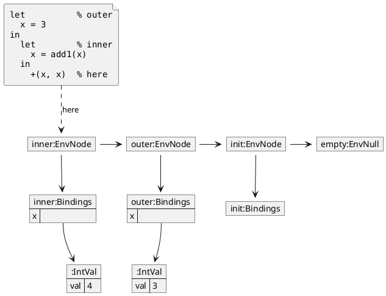

## V3

### During the inner `let` body

```plantuml
@startuml
skinparam fileFontName monospaced

file source [
let          % outer
  x = 3
in
  let        % inner
    x = add1(x)
  in
    +(x, x)  % here
]

'Environments
together {

  map "empty:EnvNull" as empty_EnvNull {
  }

  map "init:EnvNode" as init_EnvNode {
  }

  map "outer:EnvNode" as outer_EnvNode {
  }

  map "inner:EnvNode" as inner_EnvNode {
  }

}

'Bindings
together {
  map "init:Bindings" as init_Bindings {
  }

  map "outer:Bindings" as outer_Bindings {
    x =>
  }

  map "inner:Bindings" as inner_Bindings {
    x =>
  }
}

'Values
together {
  map ":IntVal" as 3_IntVal {
    val => 3
  }

  map ":IntVal" as 4_IntVal {
    val => 4
  }
}

'Edges

source ..> inner_EnvNode : here

inner_EnvNode -> outer_EnvNode
outer_EnvNode -> init_EnvNode
init_EnvNode -> empty_EnvNull

init_EnvNode --> init_Bindings
outer_EnvNode --> outer_Bindings
inner_EnvNode --> inner_Bindings

outer_Bindings::x --> 3_IntVal
inner_Bindings::x --> 4_IntVal

@enduml
```
