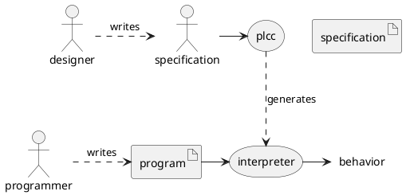
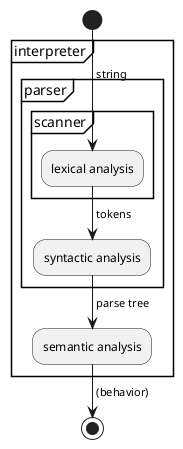
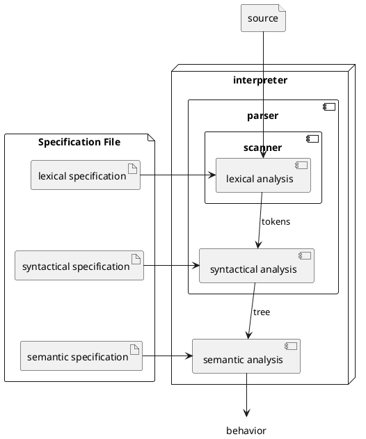

# Overview

## Interpreter

A practical way to study a programming language is to build a program that can
run programs written in that language. Such a program that reads and evaluates a
program is called an **interpreter**.

## PLCC

PLCC, first mentioned in the previous chapter, is a powerful tool that can
generate such an interpreter. PLCC generates an interpreter based on a textual
description of the programming language we wish to design. We refer to the
textual description as a specification.

The diagram below depicts the relationships among language designers,
programmers, and PLCC. Language designers write a specification for the language they
are designing. They use PLCC to generate an interpreter for the language from
its specification. Then programmers write programs in this language and use the
generated interpreter to run these programs.

In the course of this textbook, we will take on the role of a language designer.

## Language Specification

Most interpreters are built around three successive phases: lexical analysis,
syntactic analysis, and semantic analysis.

The composition of the specification read by PLCC reflects the typical interpreter's
organization. As we can see in the figure below, the specification is broken up in
three parts: lexical specification, syntactical specification, and semantic
specification. The next three chapters will go over each of these parts in
greater detail.

## Going beyond

Any program processing any input expressed in a text-based programming language
must perform lexical analysis, syntactic analysis, and semantic analysis. Such
programs include compilers, interpreters, and static analyzers (i.e., linters).
So the concepts described in this chapter apply to all such tools.

We will see that the language we use to define these specifications is itself a small programming language. We could, in principle, write a specification for the PLCC tool in its own language and ask PLCC to generate an alternate version of itself.
