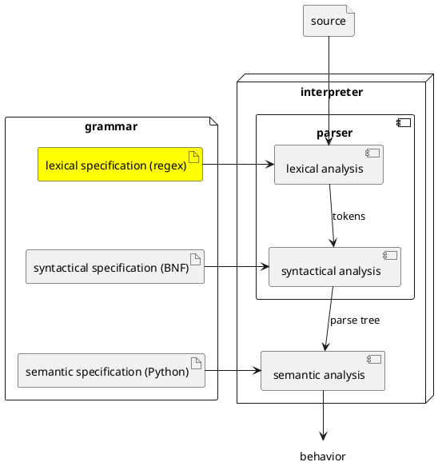

# Tokens

The first component in any of the interpreters that PLCC builds for us is called
a *lexical analyzer*, often just referred to as a *scanner*. Its role is to break the source text into a sequence of *tokens*.
It is a process reminiscent of breaking English sentences into sequences of
words and punctuation marks.



A language's **lexical specification** defines the set of legal tokens for that
language. Here is our first example of a valid PLCC specification consisting of only a
lexical specification.

```
# Lexical specification for a list of comma-separated natural numbers
skip  WHITESPACE '\s+'
token NUM        '\d+'
token COMMA      ','
```

If we save the text of this specification in a file called `spec.plcc` and run
the command `echo 1, 2, 3 | plcc-scan` in the folder containing `spec.plcc`, we
should get the following output:

```
-:1:1 NUM '1'
-:1:2 COMMA ','
-:1:4 NUM '2'
-:1:5 COMMA ','
-:1:7 NUM '3'
```

Broadly, this output says that the scanner produced by PLCC based on our
specification recognized, in the input text (i.e., "1, 2, 3"), two kinds of
patterns (i.e., tokens): (1) numbers (`NUM`) and (2) commas (`COMMA`).

## A quick tour

Let's go over the above specification line by line.

1. The first line is a comment.
2. The second line tells the scanner to recognize whitespace characters, but the
   `skip` keyword says not to emit them as a token.
3. The third line defines the `NUM` token as a sequence of one or more digits.
4. The fourth line defines the `COMMA` token as the single character `,`.

Tokens and skips definitions rely on the power and convenience of regular
expressions (abbreviated regexes) which we will cover in greater details soon.

We refer to *whitespace* as any character sequence that can be used as a
divider. These sequences can include the conventional space but also any
characters rendered as white space on the screen such as the horizontal tab.

The generated scanner will raise a lexical error when it encounters any
unrecognized character sequence.

## PLCC lexical specification

Here are some pertinent facts about a valid PLCC lexical specification.

* The lexical specification consists of comments and lexical rules.

* Comments begin with `#` and ends at the end of the line.

* A lexical rule (whether `token` or `skip`) consists of exactly three parts separated by whitespace.

* The three parts are (1) a keyword, (2) a token name, and (3) a quoted regular
  expression.

* The keyword can be either `skip` or `token`.

* A token name *must* use SCREAMING_SNAKE_CASE.

* You may enclose a regular expression in double quotes instead of single
  quotes. This can be useful if you need to match a single quote.

## Regular expressions

The third part of a token definition consists of a quoted pattern called a
*regular expression* (regex for short). Regular expressions are a well
established language for specifying patterns that match sequences of characters.

To familiarize yourselves with regular expressions, you should complete interactive
lessons 1 through 9 from [RegexOne](https://regexone.com/).

The remainder of this text assumes that we can easily read and write simple
regular expressions. In particular, we should be clear on

* the meanings of the following shorthand patterns: `\s`, `\S`, `\d`, `\D`,
  `\w`, `\W`, `[a-z]`, `[A-Z]`, and `[0-9]`,

* the role of the `*`, `+`, and `?` quantifiers,

* the difference between `.` and `\.` as well as between `[...]` and `[^...]`.

## The scanning algorithm

The scanner used by PLCC works as follows. Until the input stream is empty,
the scanner scans the stream from left to right.

1. Identify all of the patterns that match the front (left side) of the input
   stream.
2. If no match exists, raise a lexical error and halt.
3. If multiple patterns match, select the longest match.
4. If there are multiple longest matches, select the one whose definition
   appears first in the specification.
5. If the match is a token, emit it. (That means that the scanner does not emit a token if it is a skip.)
6. Remove the matched characters from the front (left side) of the input, and repeat starting
   from step 1.

Here is the same algorithm in a Python-like pseudo-code.

```python
def lex(input_stream, lexical_rules):
    while input_stream.has_more():
        matches = lexical_rules.match_front(input_stream) # Step 1
        if matches.is_empty():                    # Step 2
            raise LexError(input_stream)
        matches = matches.longest()               # Step 3
        match = matches.first_in_spec()           # Step 4
        if match.is_token():                      # Step 5
            emit(match.token())
        input_stream.remove_from_front(match)     # Step 6
```

Note: PLCC does not try to match patterns across newline characters. So a single
token cannot span multiple lines.

### Longest match wins

Steps 3 and 4 are particularly important. They break ties when multiple
patterns match the front of the input stream. Let's start with step 3, "select
the longest match". Consider the following specification:

```
token WORD '[a-z]+'
token ANY  '.+'
token HI   'hi'
```

Suppose our scanner is trying to match the front of `hi there`.
(NOTE! There are no `skip`s defined.)

All three patterns match. `WORD` and `HI` both match `hi`, but `ANY` matches
`hi there`. Since `ANY` is the longest match, it wins, and an `ANY` token is
emitted containing the lexeme `hi there` (a *lexeme* denotes the part of the
input text that a pattern matches).

### First of the longest matches win

Now consider step 4 ("first of the longest matches win"). It applies when more than
one pattern is equally the longest match. In this case, the first pattern in
the specification wins. For example, consider the following specification.

```
token WORD '\w+'
token FROM 'from'
```

And suppose our scanner is considering the string `from now on`.

In this case both `WORD` and `FROM` match `from`, and their matches are equal in
length. So they are both longest matches. To break the tie, the scanner
selects the match from the definition that appears first in the specification.
So, in this case, a `WORD` token is emitted containing the lexeme `from`.

Notice that, in this specification, `WORD` will *always win*, and `FROM` will never be
emitted. This is probably not our intention.
It is more likely that we meant `FROM` to be a special (*reserved*) word, and `WORD`
to define "any non-reserved word".

This is a common problem that can
be avoided by placing patterns with `+` and `*` quantifiers after patterns
with literal letters and punctuation symbols.
If we rewrote our example specification as follows:

```
token FROM 'from'
token WORD '\w+'
```

Now, for the same string, `from now on`, `FROM` would be emitted, which is more
likely what we want.

## References

* "Lexical Specification," PLCC-ng, version 0.65,
  https://ourplcc.github.io/plcc-ng/0.65/language-guide/lexical/

* "Snake case," Wikipedia, last modified April 9, 2026,
  https://en.wikipedia.org/wiki/Snake_case

* "Whitespace character," Wikipedia, last modified August 13, 2026,
  https://en.wikipedia.org/wiki/Whitespace_character

## Going beyond

In defining a new programming language, we must first specify the *lexical*
(from the Greek word λέξη meaning "word") structure of the language: the symbols used
to construct a program in the language. These symbols are called *tokens*.
*Lexical analysis* is the process of applying these rules by reading program
input and  isolating its tokens. Tokens comprise the "atomic structure" of a
program.

Lexical analysis is also called *scanning*. Programming language tokens normally
consist of things such as numbers (e.g., `23` or `54.7`), identifiers (e.g.,
`foo` or `x`), reserved words (also called keywords, e.g., `for`, `while`), and
punctuation symbols (`.`, `[`). Every programming language's specification
has its own distinct rules that define the tokens in the language.

A *lexical analyzer* is a program or procedure that carries out lexical analysis
for a particular language. Such a program is also called a *scanner*,
*tokenizer*, or *lexer*. The input to a scanner is a stream (sequence) of
characters, and its output is a stream of tokens. The behavior of a scanner for
a language is defined by the lexical specification of the language.

The string of input characters that makes up a token is called a *lexeme*. For
example, when you read a word (token) from printed text on a page, the
particular collection of characters that make up the word is its lexeme. In this
paragraph, the first lexeme is "The", consisting of the
individual letters 'T', 'h', and 'e'. This lexeme is an instance of an English
part of speech called an "article". In this case, "article" is the token and
"the" is the instance. The other instances of the "article" token (in English)
are "a" and "an". **A token is an abstraction, and a lexeme is an instance of
this abstraction.**

### Suggested reading

* Douglas Thain, "Scanning," chap. 3 in *Introduction to Compilers and Language
  Design,* 2nd ed., (Self-published, 2023),
  https://dthain.github.io/books/compiler/chapter3.pdf
