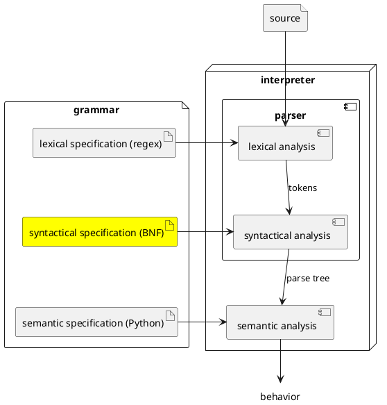

# Syntax

Assuming a proper specification is provided, the second component included in
our generated interpreters is called a *parser*. Its role is to verify that the
sequence of tokens produced by the scanner forms a syntactically valid sentence
in a given language. It is a process reminiscent of ensuring that the rules
governing how words are arranged to create well-formed English sentences are
being followed.



A language's **syntactic specification** defines the set of valid sentences for
that language. The syntactic specification builds on top of the language's
lexical specification by referring to its tokens. Here is our first example of a
valid PLCC specification for a list of comma-separated natural numbers.

```
# Lexical specification for a list of comma-separated natural numbers
skip  WHITESPACE '\s+'
token NUM        '\d+'
token COMMA      ','

%

# Syntactic specification for a list of comma-separated natural numbers
<List>          ::= <NUM> <ListTail>
<ListTail:Some> ::= COMMA <NUM> <ListTail>
<ListTail:Zero> ::=
```

If we save the text of this specification in a file called `spec.plcc` and run
the command `echo 1, 2, 3 | plcc-parse` in the folder containing `spec.plcc`, we
should get the following output:

```
List
  NUM '1' [-:1:1]
  Some
    NUM '2' [-:1:4]
    Some
      NUM '3' [-:1:7]
      Zero (empty)
```

Broadly, this output says that the parser produced by PLCC based on our
specification recognized the input as a valid "program" (no error messages
appear) and rendered, in plain text, the program's parse tree. At the root of
the tree, we find a `List`. This root node has two children: a number (`NUM`)
and the list's remainder (`Some` and `NUM` line up horizontally because they
are both children of `List`.) `NUM`
is a terminal symbol and therefore has no children. The first `Some`, on the
other hand, is a non-terminal symbol that itself has two children and so on.
(Notice the recursion!)

Below is a diagram depicting that same output highlighting the arborescent
structure more strikingly.

```plantuml
@startuml
object List
object "Num@1"
object "Some@1"
object "Num@2"
object "Some@2"
object "Num@3"
object "Zero"

"Num@1" : num = 1
"Num@2" : num = 2
"Num@3" : num = 3

List -- "Num@1"
List -- "Some@1"
"Some@1" -- "Num@2"
"Some@1" -- "Some@2"
"Some@2" -- "Num@3"
"Some@2" -- "Zero"
@enduml
```

## A quick tour

Let's go over this specification. At the top, we recognize the lexical
specification described in the previous chapter. Below, after the percent
symbol, we find a syntactic specification described in a dialect of Backus-Naur
form (BNF). The first actual line of the syntactic specification, after the
second comment, says that a list of numbers consists of a number followed by the
rest of list. The next two lines say that the rest of the list is either empty
(the third line) or at least one more number, preceded by a comma and
followed by the rest of the list (the second line).

## PLCC syntactic specification

### Basic rules

As stated in the introduction of this chapter, syntactic specifications are
commonly written in BNF, a common notation system for specifying the syntax of
programming languages. This section describes PLCC's dialect of BNF. A BNF
specification builds on top of the language's lexical specification by referring
to its tokens.

Most rules in our BNF have the form `LHS ::= RHS`. The left-hand side (`LHS`)
names a single *non-terminal* symbol (e.g., `List` or `ListTail`). The
right-hand side (`RHS`) defines the structure of that non-terminal symbol. The
`RHS` may contain tokens, also known as *terminal* symbols, and non-terminals.
In tree nomenclature, identifying a node as "terminal" means it has no child nodes.
Many of our symbols will be enclosed in a pair of angular brackets (`<` and
`>`). Non-terminal symbols in this text follow the PascalCase writing format.

For instance, the second line of our first example of a syntactic specification
says that the non-terminal `ListTail` may consist of a `COMMA` (a terminal symbol),
followed by a `NUM` (a second terminal symbol), and ending with `ListTail` (a
non-terminal symbol).

The non-terminal on the `LHS` of the *first* syntactic rule plays an important
role in our specification. We call that non-terminal the *start symbol*.

### Alternatives

An important feature of grammars is the ability to define alternative rules,
that is, to be able to have more than one rules with same `LHS`. However, PLCC
requires that we disambiguate among rules with common `LHS` through distinct
suffixes. A suffix follows the name of the non-terminal symbol separated with
a colon (`:`).

The last two lines of the example syntactic specification given at the beginning
of this chapter provide an illustration: The non-terminal `ListTail` has two
alternative definitions (one is empty, the other is not), with two different
suffixes (`Some` and `Zero`, respectively).

When a non-terminal shows up on a RHS it must be written as its simple name,
without a suffix. You know from that that any choice for the breakdown of that
non-terminal is acceptable. But because of some issues that will be covered
in the chapter on the semantic section, we need distinct names for each choice
so that they can be distinguished in code generated by PLCC for the semantic
analyzer.

### One or more and the empty string

Another important tool in the bag of language designers is allowing
sentences/programs
of arbitrary length. BNF relies on recursion to provide this capability: The
non-terminal on the `LHS` may appear on the `RHS` of its definition.

The second line of the introductory example syntactic specification illustrates
this concept: The non-terminal `ListTail` is defined in terms of itself because the
symbol `ListTail` also appears on the `RHS`. The definition says that we can
substitute `ListTail` with the sequence consisting of a `COMMA`, followed by a
`NUM`, and ending with another `ListTail`. We can apply this substitution again
to replace (or match) the latter `ListTail` with another `COMMA`, `NUM`, and
`ListTail` sequence. To avoid infinite recursion, we need a base case, which is
provided by the definition appearing on the third line. This definition provides
an alternative definition for `ListTail`. It states that `ListTail` may be
nothing. That is, we can satisfy `ListTail` by matching no symbol at all (i.e.,
by matching the empty string).

This recursive capability stresses the importance of being able to provide
alternative definitions.

### Zero or more

What if we want to allow our list of numbers to be empty? Below is a possible
specification.

```
# Syntactic specification for a list of possibly empty, comma-separated numbers
<List:LSome>    ::= <NUM> <ListTail>
<List:LZero>    ::=
<ListTail:Some> ::= COMMA <NUM> <ListTail>
<ListTail:Zero> ::=
```

Again we make use of alternate definitions and an empty `RHS`.

### Repetition and separator: syntactic sugar

Repetition (e.g., a list of things), possibly separated by a punctuation or
separator (e.g., comma-separated lists), is so common that PLCC's BNF notation
provides some *syntactic sugar* for expressing sequences. We can replace the
entire previous specification with the single line (not counting the comment)
below.

```
# Syntactic specification for a list of possibly empty, comma-separated numbers
<List> **= <NUM> +COMMA
```

The `**=` metasymbol means zero or more; so it may match the empty string.
Specifying a sequence containing at least one element is left as an exercise for
the reader.

The separator is specified by a token (here `COMMA`) immediately
following the `+` metasymbol. If there is no `+` and token provided, then
the parser will look for a sequence of the given token with no separator
between the tokens.

### LL(1)

Consider the specification below.

```
<List:Only> ::= <NUM>
<List:More> ::= <NUM> COMMA <List>
```

At first glance, it appears to be a valid specification for a non-empty, comma-separated list of
numbers. Unfortunately, PLCC will not accept this specification. The stated
reason is that this specification is not an *LL(1)* grammar and PLCC can only
generate LL(1) parsers. It is not the purpose of this text to explore
the different types of grammars and parsing theory. Suffice to say that LL(1)
implies parsers processing input from **L**eft to right, performing
**L**eftmost derivation with a single (**1**) token lookahead. You can find
further information and references in the "Going beyond" section below.

The problem with the specification above is that the parser cannot distinguish
between the two alternatives when encountering a number. The fact that both
alternatives start with the same token, `NUM`, and that the parser can only
look a single token ahead leads to an ambiguity where the parser cannot choose
the appropriate alternative based on the information at hand.

## References

* "Backus–Naur form," last modified July 5, 2026,
  https://en.wikipedia.org/wiki/Backus-Naur_form

* "Camel case," last modified July 3, 2026,
  https://en.wikipedia.org/wiki/Camel_case

* "LL parser," last modified April 30, 2026,
  https://en.wikipedia.org/wiki/LL_parser

* "Syntactic sugar," Wikipedia, last modified April 6, 2026,
  https://en.wikipedia.org/wiki/Syntactic_sugar

## Going beyond

### Backus-Naur form

There exists variations on BNF form that PLCC does not use but you may encounter
in your reading. These variations may be referred to as Extended BNF, or simply
EBNF. For example, instead of writing alternatives on separate lines as
different definitions, we can use the *alternation* metasymbol `|`. Using this
extended notation, the definition of the non-terminal `List` can be rewritten
as shown below where the metasymbol `ε` means the empty string.

```
<List> ::= <NUM> <ListTail> | ε
```

PLCC could not be made to accept this form because each choice of a `RHS` for
a non-terminal must have its own name.

### Parser generators

PLCC is not the only tool capable of generating parsers. *Yacc* (Yet another
compiler-compiler) is an early
example of such a tool. It was distributed as a standard utility with some
distributions of the Unix operating system. *GNU Bison* is another parser
generator that is part of the GNU Project. In some ways Bison is compatible
with Yacc. Refer to the suggested readings for more information.

### Suggested readings

* Douglas Thain, "Parsing," chap. 4 in *Introduction to Compilers and Language
  Design,* 2nd ed., (Self-published, 2023),
  https://dthain.github.io/books/compiler/chapter4.pdf

* Douglas Thain, "Parsing in Practice," chap. 5 in *Introduction to Compilers
  and Language Design,* 2nd ed., (Self-published, 2023),
  https://dthain.github.io/books/compiler/chapter5.pdf
