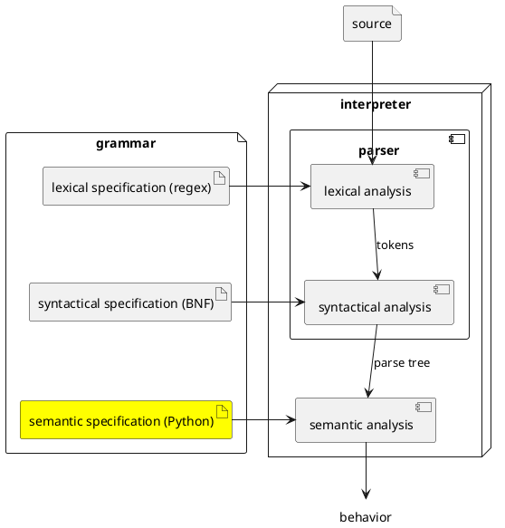

# Semantic

So far, we have learned how to write a lexical specification using regular
expressions from which PLCC generates a scanner that reads a string and produces
a sequence of tokens. We have also learned to write a syntactic specification in
BNF from which PLCC generates a parser that reads the sequence of tokens given
by the scanner and produces a parse tree.



Now we turn our attention to semantic analysis. The semantic of a program
written in a language, its meaning, is what it does when we run it. Building on
our running example, the specification below defines a small language that adds
natural numbers in a comma-separated list.

```
# Lexical specification for a list of comma-separated natural numbers
skip  WHITESPACE '\s+'
token NUM        '\d+'
token COMMA      ','

%

# Syntactic specification for a list of comma-separated natural numbers
<List>          ::= <NUM> <ListTail>
<ListTail:Some> ::= COMMA <NUM> <ListTail>
<ListTail:Zero> ::=

%

# Semantic specification for a list of comma-separated natural numbers:
# Compute the sum of the numbers

Python

List
%%%
def _run(self):
    n = int(str(self.num))
    sum = n + self.listTail.eval()
    print(str(sum))
%%%

Some
%%%
def eval(self):
    n = int(str(self.num))
    sum = n + self.listTail.eval()
    return sum
%%%

Zero
%%%
def eval(self):
    return 0
%%%
```

If we save the text of this specification in a file called `spec.plcc` and run
the command `echo 1, 2, 3 | plcc-reg` in the folder containing `spec.plcc`, we
should get the following output:

```
6
```

## A quick tour

Let's go over the above specification. Recall that PLCC uses the single percent
sign (`%`) as a separator between sections of the specification. The first two
sections (lexical and syntactical) should look familiar by now.

The substantial addition to the specification, following the second single
percent sign, is the semantic section. It describes the meaning associated with
each type of nodes that can appear in the parse tree generated by the parser.
Specifically the specification associates a piece of Python code with each of
the rules appearing in the syntactical section.

Also remember that a `List` is defined to be a natural number (`NUM`) followed by the
rest of the list (`ListTail`). Correspondingly the semantic specification
associated with `List` first extracts the actual value of that number
(`int(str(self.num))`) and saves it in variable `n`. The second line of the
specification first invokes the semantic action associated with the rest of the
list (`self.listTail.eval()`), then adds the returned value to the content of
`n`, and saves the result of the addition in `sum`. Finally, the semantic
specification returns the content of `sum`.

The rest of the semantic specification should be similarly simple to grok. For a
non-empty list remainder, we extract the actual value of the next number saving
it in variable `n`, we process the rest of the list adding the returned value to
`n`, and we conclude by returning the sum. Likewise, for an empty list
remainder, having no more numbers to process, we return zero.

## PLCC semantic specification

The semantic section of a PLCC specification starts after the second percent
sign (`%`) appearing on its own line. If we do not want to provide a semantic
section, we can omit the second percent sign (as we have seen in previous
chapters).

There are different approaches to associate meaning to a programming language.
Alternatives include *operational*, *axiomatic*, and *denotational*. In PLCC, we
specify the semantics for a language operationally. That approach means we write
a program in a well-defined programming language (e.g., Python) that exhibits
the meaning of any program written in the defined language (the new language we
are designing). In short, we implement the tool for our new language in some
existing and hopefully familiar programming language. PLCC supports multiple
programming languages for use in the semantic specification. In this text, we
will use Python. As such the first significant line of the semantic
specification consists of a separate line containing the single word `Python`.

The rest of the semantic section consists of the associations of meaning to each
of the possible types of nodes that can appear in the parse tree (which also
corresponds to each of rules defined in the syntactic section). Each
association consists of the type name (e.g., `List`) on its own line followed by
zero or more Python method definitions enclosed in a pair of three percent
signs (`%%%`).

### Interpreter code organization

PLCC creates a class (or subclass) for each of the rules defined in the
syntactical section of the specification. Generally, the name of the created
class is the same as the name of the non-terminal appearing in the `LHS` of the
corresponding rule (e.g., `List`). PLCC then adds attributes (also called fields
or members) to this class according to the `RHS` of the rule. Each angular
bracketed symbol (e.g., `<NUM>` and `<ListTail>` but not `COMMA`) appearing in
the `RHS` becomes such an attribute. The type of an attribute derived from a
terminal symbol (i.e., a token) is a special type that PLCC defines for us
called `Token`; this attribute will hold the lexeme that matched the token. The
type of an attribute derived from a non-terminal symbol is the class created for
that non-terminal symbol. Generally, PLCC names attributes according the
following conventions:

* The name of an attribute derived from a terminal symbol is the name of the
  corresponding token with all its letters converted to lowercase (e.g., `<NUM>`
  becomes the attribute `num`).

* The name of an attribute derived from a non-terminal is the name of that
  non-terminal with its first letter converted to a lowercase (e.g.,
  `<ListTail>` becomes the attribute `listTail`).

### Attribute access and conversions

All functions defined in the semantic section become attribute methods. PLCC
will include these methods in the pertinent class definitions associated with
each the syntactic rules. Therefore, all these functions must take an instance
of a class as the first parameter (conventionally called `self`). Then access to
attributes employs the usual dot notation (e.g., `self.num` and
`self.listTail`).

As stated in the previous section, bracketed tokens found in the `RHS` of
syntactic rules become attributes of type `Token` in the code generated by PLCC.
PLCC's class `Token` defines the special method `__str__` that returns the
lexeme associated with any instance of that token in the form of a string (type
`str` in Python). Then our code can convert that string into any type that
context demands. For instance if the token represents a natural number, we can
convert the lexeme to an integer with the Python built-in function `int` (e.g.,
`int(str(self.num))`). The same built-in function can be used to support numbers
represented in a different base (e.g., octal base, `int(str(self.num),
base=8)`). Should our token represent the approximation of a number on the real
line, we can convert the lexeme with the Python built-in function `float` (e.g.,
`float(str(self.num))`). If we care only for the string representing the lexeme,
then can just use the output of the string conversion (e.g., `str(self.num)`).

Attributes associated with non-terminals found in the `RHS` of syntactic rules
are of a type corresponding to the class PLCC creates for each non-terminal.
We can then access methods defined for these classes using the usual dot
notation (e.g., `self.listTail.eval()`).

### Start symbol

Remember that the `LHS` of the first rule defined in the syntactic section of a
specification becomes the start symbol (i.e., the root of the parse tree). The
semantic associated with that node must define a method with the following
signature: `_run(self)`.

### Alternatives

As stated earlier, PLCC generally names created classes based on the name of the
corresponding non-terminal symbol appearing in the `LHS` of a rule. An
exception to this rule occurs when a specification has more than one rule with
the same `LHS` symbol. In this case, PLCC bases the name of the class on the
associated suffix.

### Repetition

Suppose we define our list of natural numbers using the repetition metasymbol
introduced in the previous chapter:

```
<List> **= <NUM> +COMMA
```

How must our semantic specification handle this syntactic notation?

Under such situation, PLCC generates the following code (found by default under
the folder `plcc-ng`):

```python
class List(_Start):

    def __init__(self, numList):
        super().__init__()
        self.numList = numList
```

As we can see, PLCC defines `List` as a subclass of `_Start` and an initializer
which, after initializing the enclosing class instance (i.e., `_Start`),
initializes attribute `numList`. In other words, PLCC stores the lexemes
associated with non-terminal `List` as a list of tokens. Our semantic code can
then walk through this list as follows:

```python
for n in self.numList:
    sum += int(str(n))
```

### Repeated symbols in RHS

Our semantic specification must be able to distinguish among repeated symbols
appearing in the `RHS` of syntactic rules. Again PLCC relies on suffixes,
separated from the symbol's name with a colon (`:`), to achieve disambiguation.

Suppose we have the following syntactic rule defining a pair of numbers:

```
<Pair> ::= <NUM> COMMA <NUM>
```

How should our semantic definitions distinguish between the first and second
numbers? In fact, PLCC warns us about such situations. If we try to build a
parser (e.g., with the command `plcc-parse`), PLCC gives up and returns the
following error:

```
plcc-make: plcc-validate-syntactic failed (exit 1)
plcc-validate-syntactic: spec.plcc:9:1: error: duplicate RHS symbol name 'num' — all capturing RHS symbols must have unique names
<Pair> ::= <NUM> COMMA <NUM>

^
```

We fix this problem by adding suffixes, for example:

```
<Pair> ::= <NUM:m> COMMA <NUM:n>
```

Our semantic specification can then refer to these numbers as follows:

```python
def _run(self):
    print(f'A pair containing {self.m} and {self.n}')
```

Note that the semantic associated with Python format strings implicitly calls
`str` on its arguments.

### Additional code

As we have seen earlier in this chapter, PLCC creates classes for each of the
non-terminal symbols appearing in our grammar. We will want the ability to add
code unrelated to these automatically created class. If PLCC encounters an entry
of the form

```
ClassName
%%%
...
%%%
```

where `ClassName` stands for a class that is *not* one of the automatically
generated class, then PLCC generates a new file called `ClassName.py` containing
the code bracketed by the `%%%` lines. This feature enables adding entire Python
source files to augment the semantic of the defined language. In this situation,
there is no automatically generated class templates, so the Python code must be
a complete Python source file, not just a method. We will see this feature in
action in subsequent chapters.

### Include

An include directive allows a PLCC language specification file to include the
contents of other files, making them part of a single specification. In this
way, separately created files can be combined together to form one language
specification. The names of included files must be given in the semantic
section of the specification file, and generally appear at its end. Here is an
example taken from a specification that we will study in a subsequent chapter:

```
%include code
%include env
%include prim
%include val
```

## References

## Going beyond

### Suggested readings
