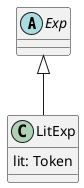
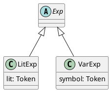
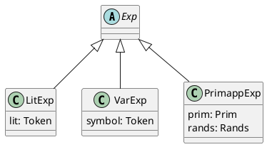

# Language V0

The last few chapters have described means to describe languages through a
specification comprised of three sections: lexical, syntactical, and semantic.
We are now in a position to start exploring important ideas in programming
language concepts. To do so, we will start with a very simple language, `VO`,
and, in the course of several chapters, gradually add to its power.

`V0` is a limited language that allows us to write rudimentary arithmetic
expressions. The only semantics associated with the language is to echo back its input
in a standard format.
We are focusing on the syntax of `V0` in this chapter.
Its lexical and syntactical specification is reproduced below.
Its full semantic specification in Python is available
[elsewhere](https://github.com/ourPLCC/languages-ng/blob/v1.0.0/src/V0/python/spec.plcc).

```
# Language V0
# primitive expressions
skip WHITESPACE '\s+'
skip COMMENT '%.*'
token LIT '\d+'
token LPAREN '\('
token RPAREN '\)'
token COMMA ','
token ADDOP '\+'
token SUBOP '\-'
token ADD1OP 'add1'
token SUB1OP 'sub1'
token SYMBOL '[A-Za-z]\w*'
%
<Program>        ::= <Exp>
<Exp:LitExp>     ::= <LIT>
<Exp:VarExp>     ::= <SYMBOL>
<Exp:PrimappExp> ::= <Prim> LPAREN <Rands> RPAREN
<Rands>          **= <Exp> +COMMA
<Prim:AddPrim>   ::= ADDOP
<Prim:SubPrim>   ::= SUBOP
<Prim:Add1Prim>  ::= ADD1OP
<Prim:Sub1Prim>  ::= SUB1OP
```

With this specification, running `plcc-rep` on `add1(+(2, 3))` more or less
simply echoes back the input:

```
add1(+(2,3))
```

The action of `V0` can be thought of as a pretty-printer: It outputs the
original program in some consistently applied formatting rules.

## A quick tour

As expressed by the first BNF rule of our specification, a `V0` program
(`Program`) consists of an expression (`Exp`). In turn, an expression can be one
of three things: a whole number literal (i.e., the terminal `LIT`), the name of a variable
(i.e., the terminal `SYMBOL`), or the application of a primitive operator to
operands following the operator as a comma-separated list enclosed in a pair of
parentheses.

## Examples

Example "programs" in this language include the following:

* `3`
* `x`
* `+(3, x)`
* `add1( +(3, x) )`
* `+(4, -(5, 2))`

## Discussion

Observe first that `V0` writes expressions in *prefix form*, where the operator
(such as `+` or `-`) precedes its operands. We would normally write the `V0`
expression `+(3, x)` as $3 + x$ with the operator written between the two
operands. The latter is known as the *infix form*. We have favored the prefix
form because it is easier to parse and to evaluate. The prefix form is not
entirely unusual. Languages in the Lisp family (include Scheme) use prefix form
and other languages (such as Haskell) have a special notation to use infix
operators in prefix form.

## Syntax

Let us focus on the grammar rules for the different kinds of expressions. As
stated earlier, in `V0`, expressions come in three forms: literals, variables,
or applications of an operator.

### Literals

Let us start with literals. The grammar rule for this type of expressions is
straightforward and the RHS consists of just the token `LIT`:

```
<Exp:LitExp>     ::= <LIT>
```

As we have seen in the chapter on syntax specification, PLCC translates this
rule into an abstract class `Exp` and a subclass `LitExp` with a single
attribute named `lit`. The next figure illustrates this structure:



The initializer type signature for `LitExp` is `__init__(self, lit)`.

### Variables

An expression can also consist of a variable leading a grammar rule with a
pattern very similar to the rule involving literals. On the RHS, we simply
replace token `LIT` with `SYMBOL`:

```
<Exp:VarExp>     ::= <SYMBOL>
```

The next figure illustrates the expanded class structure:



The initializer type signature for `VarExp` is `__init__(self, symbol)`

### Operator applications

Finally, an expression can be the application of a primitive operator. Such an
expression consists of the operator (`Prim`) followed by a list of
comma-separated operands (`Rands`) enclosed in a pair of parentheses:

```
<Exp:PrimappExp> ::= <Prim> LPAREN <Rands> RPAREN
```

Properly placed parentheses are important for syntax analysis, but they play no
role beyond. Therefore the lexemes associated with them do not need to be
recorded and the tokens appear without angular brackets. The non-terminal
symbols however become attributes whose types correspond to the associated
classes. The figure below illustrates the complete class structure for
expressions:



The initializer type signature for `PrimappExp` is
`__init__(self, prim, rands)`, taking one more argument than the other two types
of expressions.

## Semantics

The semantic specification of `V0` (not shown above but available
[elsewhere](https://github.com/ourPLCC/languages-ng/blob/v1.0.0/src/V0/python/spec.plcc)),
simply outputs its input in a regular format. For instance,
running `plcc-rep` on `add1(   +(2, 3))`
will output `add1(+(2,3))`, without any
whitespace. We are not going to discuss the semantic section further
here, instead encouraging our readers to take some time to study it.

## References

* "Language V0," ourPLCC, version 1.0.0,
  [https://github.com/ourPLCC/languages-ng/tree/v1.0.0/src/V0](https://github.com/ourPLCC/languages-ng/tree/v1.0.0/src/V0)

* "Infix notation," Wikipedia, last modified February 17, 2025,
  [https://en.wikipedia.org/wiki/Infix_notation](https://en.wikipedia.org/wiki/Infix_notation)

* "Pretty-printing," Wikipedia, last modified July 18, 2026,
  [https://en.wikipedia.org/wiki/Pretty-printing](https://en.wikipedia.org/wiki/Pretty-printing)

* "Polish notation," Wikipedia, April 27, 2026,
  [https://en.wikipedia.org/wiki/Polish_notation](https://en.wikipedia.org/wiki/Polish_notation)

* "Reverse Polish notation," Wikipedia, July 9, 2026,
  [https://en.wikipedia.org/wiki/Reverse_Polish_notation](https://en.wikipedia.org/wiki/Reverse_Polish_notation)
