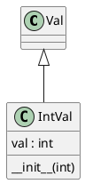
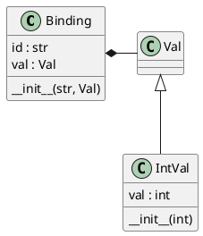
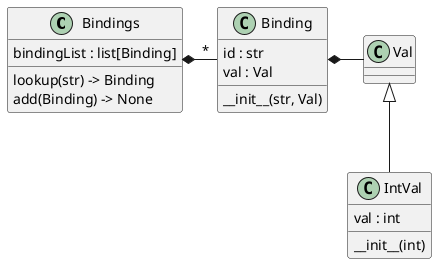
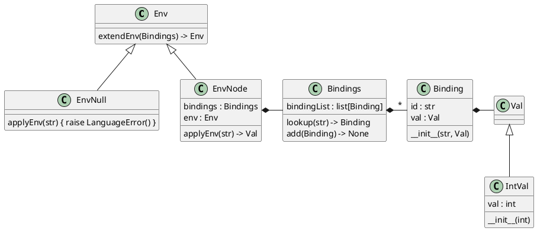

# Interlude: Variables, bindings, environments

`VO` is nice and good but we would like the semantics associated with our
languages to be able to do more than just pretty-print the input program.
Specifically, we would like to evaluate primitive expressions written in `V0` to
a single, final value following familiar arithmetic laws.

Evaluation of `V0` expressions seems pretty straightforward except perhaps for
the symbols that can appear in those expressions. How should these symbols be
evaluated?

To solve this issue with an eye towards flexibility, we introduce the concepts
of *variables*, *bindings*, and *environments*.

## Variables

A *variable* in a program is a symbol that has an associated value at runtime.
We wish to store values of different types. One approach to achieve this
flexibility is through abstract classes. The base class (`Val`) represents a
generic value. Derived classes represent the different types of values we need
to support. For now, let's just worry about integer values (`IntVal`). The
figure below illustrates this hierarchy.

## Bindings

At any instant in time, the value associated with a variable is called a
*binding* of the variable to the value. Building upon the class definitions
described in the previous section, we can define a binding with a pair of
attributes as shown below. The first attribute (`id`) is a symbol representing a
particular variable. The second attribute (`val`) binds a value to that
variable. To initialize a binding, we simply provide a variable name and its
value.

Now we need to keep track of bindings, add to an existing set of such bindings,
and look up bindings based on a variable name. The figure below illustrates the
design. The class `Bindings` consists of a single attribute collecting all
bindings and provides two methods, one to look up a binding based on a variable
name and another to add to the existing collection of bindings.

## Environments

Our languages will eventually need a hierarchy of bindings. We achieve this
flexibility with the concept of an environment, which contains a single `Bindings`
object. The hierarchy is created by making the `Environment` class a node that
points to its parent environment. The figure below illustrates the concept.

Do not worry too much, if upon first reading, you are left daunted by the
complexity of this data structure. We will see this organization in action in
subsequent chapters. Hopefully the usefulness and power of this arrangement
will soon make complete sense.

The environment's base class (`Env`) defines a method (`extendEnv`) to extend an
existing environment with a new *child* environment containing an initial set of
bindings. From this base, we define
two alternative derived classes: `EnvNull` and `EnvNode`.
The class `EnvNode` defines two attributes (`bindings` and `env`) and one key
method (`applyEnv`). The attributes hold bindings for this node and a pointer
to the next environment node in the hierarchy, respectively. `applyEnv` attempts
to look up a variable, i.e., resolve a variable to its value.
The method first looks up the variable in this node's
bindings. If unsuccessful, it passes the request up to the next environment
node in the hierarchy.
You can think of the class `EnvNull` as representing
a default, unadorned environment. It contains no bindings at all and
if we try to look up a variable, it will fail. It is used as the root
of the hierarchy to terminate an (unsuccessful) search.

