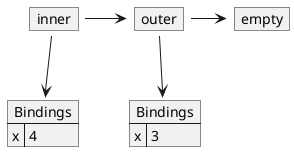

# Language V3

In Language `V3`, we add the concept of `let` expressions.

## Quick overview

The purpose of a `let` expression is to create an environment with new variable
bindings and to evaluate an expression using these variable bindings.

The relevant grammar rules and abstract syntax representations are shown below.

```
<Exp:LetExp>     ::= LET <LetDecls> IN <Exp>
__init__(self, letDecls, exp)

<LetDecls>       **= <IDENT> EQUALS <Exp>
__init__(self, symbolList, expList)
```

The lexical section adds the obvious definitions for the tokens `LET`, `IN`, and
`EQUALS`.

Below is an example program in Language V3 that evaluates to 7.

```bash
$ echo "let three = 2 four = 5 in +(three, four)" | plcc-rep
7
```

## `let` expression

The `let` expression consists of a series of declarations (`LetDecls`),
following the `let` keyword, and a body (`Exp`), following the `in` keyword.

To evaluate a `let` expression, we perform the following steps:

1. Create a set of local bindings by binding each of the identifiers to the
   values of their corresponding expressions in the declarations part of the
   construct, where the expressions to the right of the equal signs are all
   evaluated in the enclosing environment;

2. Extend the enclosing environment with these local bindings to create a new
   environment; and

3. Use this new environment to evaluate the expression in the body of the
   construct, and return that value as the value of the `let` expression.

Remember that *a `let` expression is an expression, and as such, it evaluates
to something!*

## Examples

Now that we can define our own environments, we will remove our initial
environment with bindings for Roman numerals.

In the first example, a new environment is created binding `x` to `3` and `y` to
`8`, so that the `+(x,y)` expression evaluates to `11`.

```bash
echo "let
        x = 3
        y = 8
      in
        +(x,y)" | plcc-rep
11
```

In the second example, a new environment is created binding `x` to `10`. The
body of this `let` expression is itself a `let` expression with bindings of
`z` to `3` and `y` to `8`. The environment of the inner `let` *extends* the
environment of the outer `let`, so that the `x` in the expression `+(x,y)` is
bound to `10`. The entire expression therefore evaluates to `18`.

```bash
echo "let
        x = 10
      in
        let
          z = 3
          y = 8
      in
        +(x,y)" | plcc-rep
18
```

In the third example, two new environments are created. The outer `let` binds
`x` to `3`. The inner let binds `x` to the value of `add1(x)` and `y` to the
value of `add1(x)`. Both `add1(x)` expressions in the inner let, are evaluated
*using the outer (enclosing) environment* which has `x` bound to `3`. Thus
`add1(x)` evaluates to `4` *in both cases*. Thus, in the inner environment, `x`
is bound to `4` *and* `y` is bound to `4`, so that the `+(x,y)` expression
evaluates to `8`.

```bash
echo "let
        x = 3
      in
        let
          x = add1(x)
          y = add1(x)
        in
          +(x,y)" | plcc-rep
8
```

Observe also that the `add1` primitive is *not* side-effecting. What this means
is that the expression `add1(x)` does not modify the value bound to `x`.

### `eval`

The code for `eval` in the `LetExp` class is straight-forward.

```python
def eval(self, env):
    nenv = self.letDecls.addBindings(env)
    return self.exp.eval(nenv)
```

The `addBindings` method returns an environment object that extends the
environment parameter (`env`) by adding the bindings given in the `let`
declarations. We use this extended environment to evaluate the body of the `let`
expression.

A `LetDecls` object has two attributes: `identList` is a list of `Token` objects
representing the `IDENT` part of the BNF grammar rule and `expList` is a list
of expressions representing the `Exp` part of the BNF grammar rule.

Our plan for defining the `addBindings` method in the `LetDecls` class involves
evaluating each of the expressions in `expList` in the enclosing environment and
binding these values to their corresponding lexemes in `varList`. We then
use these bindings to extend the enclosing environment given by the `env`
parameter, and we return this new environment to the `eval` method in the
`LetExp` class.

By coincidence, the `Rands` object already has an `evalRands` method that
evaluates each of the expressions in its `expList` attribute, so we simply reuse
the `Rands` class and its `evalRands` method here.

```python
def addBindings(self, env):
    valList = [e.eval(env) for e in self.expList]
    bindings = Bindings(self.identList, valList)
    return env.extendEnv(bindings)
```

The `LetDecls` initializer throws and exception if it finds duplicate
identifiers in its `varList`. This means that a `let` expression cannot have two
instances of the same LHS identifier. The code to check for duplicates is
inserted into the `LetDecls` class initializer using the `:init` hook.

```
LetDecls:init
%%%
Env.checkDuplicates(self.identList, " in let LHS identifiers")
%%%
```

### Scope

The languages we have discussed do not allow mutation of variables, although you
might be tempted to think that this Language `V3` program is doing something
akin to mutation:

```
let
  x = 3
in
  let
    x = add1(x)
  in
    +(x, x)
```

This program evaluates to `8` (which is not surprising), but in the scope of the
outer `let`, the variable `x` is still bound to `3` as illustrated in the
following figure.



To see clarify this point, consider the following variant of the preceding
program:

```
let
  x = 3
in
  +(let x = add1(x) in x, x)
```

Observe first that the figure above is still an accurate illustrations of the
various environments involved for this variant. However, the value resulting
from the variant's execution is different.

The last occurrence of `x` in the expression evaluates to `3` because the
variable `x` in the inner `let` has scope only through the inner `let`
expression body. Outside of the inner `let` expression body, the binding of `x`
to `3` remains unchanged. Thus the entire expression evaluates to `7`.

Here is another important observation. In the `LetDecls` rule, each `IDENT`
token is called the *left-hand side* (LHS) of the binding and the corresponding
`Exp` is called its *right-hand side* (RHS). (Don’t confuse these definitions
with the `LHS` and `RHS` of the grammar rule itself.) All of the RHS expressions
in a `LetDecls` are evaluated in the enclosing environment. *The LHS `IDENT`
variables become bound to their corresponding RHS expression values **after**
all of the RHS expressions have been evaluated*. Thus the following expression

```
let
  p = 4
in
  let
    p = 42
    x = p
  in
    x
```

evaluates to 4.

## Discussion

Scope is a very important concept in programming languages. Scoping rules will
vary from one programming language to another. For instance, the C language
supports *block scope* which creates a new scope for each embedding of a new
block. Therefore, the following function definition is valid.

```c
int f(int x) {
    {
        int x = 1;
        {
            int x = 2;
            return x;
        }
    }
}
```

This function returns `2` regardless of the value passed as its argument. In
contrast, Python does not support block scope.

The `let` expression was first introduced in the Programming language for
Computable Functions (PCF) and adopted in most functional programming languages
since.

As we have seen earlier in this chapter, our `add1(x)` primitive operator does
not modify the value of `x`. In this respect, it does not behave the same way
as `++x` does in languages such as C and Java.

It is useful to avoid viewing bindings introduced in this chapter as variable
assignments. It is more profitable to regard them as *naming* computed values.
Indeed, once named, our values cannot be modified. Contrast this situation with
assignments in C or Python. The content of variables in these languages can
(almost) always be modified after initialization.

## References

* "Let expression," Wikipedia, last modified January 20, 2026,
  https://en.wikipedia.org/wiki/Let_expression

* "Scope (computer programming)," Wikipedia, last modified June 3, 2026,
  https://en.wikipedia.org/wiki/Scope_(computer_programming)