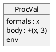

# Language V4

So far our languages do not allow for anything like repetition. In an
expression-based language (ours fall into this category), repetition is
typically accomplished by recursion, and recursion depends on the ability to
apply function recursively. So we need the ability to define and to apply
functions.

As a starting example, consider the following `V4` program.

```
let
  f = proc(x) +(x, 3)
in
  .f(5)
```

Using `V4`'s specification, this program evaluates to `8`.

## A quick tour

The declaration in the `let` expression defines a function using the `proc`
keyword and binds it to a name (i.e., `f`). The `let` body applies the function
using the dot character (`.`) followed with a single parameter (i.e., `5`).

## Functions

A function is a reusable unit of computation. It consists of parameters, an
expression (the computation), and an environment (more on this later).

To *define* a function means to describe how it behaves. To *apply* a function
means to give the function the proper number of parameters and to receive its
result. *Formal parameters* refer to the list of parameters appearing in a
function definition. *Actual parameters* refer to the list of parameters
appearing in a function application. The number of parameters that a function
accepts is called its *arity*. A function can have zero parameters in which
case the function acts as a constant.

The parameters enable the computation to operate on dynamic input. When applied
with a matching set of actual parameters, the function returns the value
obtained by evaluating the expression in its body given the values of the
parameters and the environment.

In the function definition given in the introductory example `x` is the single
formal parameter and `+(x, 3)` is the body.

It may be useful to think of a function as a "black box" that, when given zero
or more parameters, returns a single result value.

A function must be defined before it can be applied.

## Syntax

### Function definition

In `V4`, a function definition is just another kind of expression called
`ProcExp`. Such expressions have the following syntax:

```
<Exp:ProcExp>    ::= <Proc>
<Proc>           ::= PROC LPAREN <Formals> RPAREN <Exp>
<Formals>        **= <SYMBOL> +COMMA
```

The table below shows several examples function definitions:

Definition | Explanation
-|-
`proc () 3`                    | When applied, evaluates to 3
`proc (x) *(x, 2)`             | Doubles the argument it is applied to
`proc (a, b, c) +(a, +(b, c))` | Sums its three arguments

As all expressions do, each of the above function expressions evaluates to a
value. They evaluate to another specialization of `Val` called `ProcVal`. This
fact implies that a `ProcVal` can occur anywhere a `Val` is expected. Each
`ProcVal` represents the defined function and contains everything it needs
to be applied to some parameters. A `ProcVal` consists of the formal parameters
(a list of identifiers), an expression (the body), and an environment (more on
this later; honest).

The figure below illustrates the content of the `ProcVal` associated with the
function definition appearing in the introductory example.



You may have noticed that `ProcExp` does not provide a name for the function.
The defined function is *anonymous*. But, because `ProcExp` evaluate to a
`ProcVal`, we can bind a `ProcVal` to an identifier:

```
let
  three = proc () 3
  double = proc (x) *(x, 2)
  sum_three = proc (a, b, c) +(a +(b, c))
in
  ...
```

### Function application

Our explanations so far have focused on function definitions. We turn our
attention now to applying a function. The application of a function is another
kind of expression:

```
<Exp:AppExp>     ::= DOT <Exp> LPAREN <Rands> RPAREN
```

Below is a full example:

```
let
  three = proc () 3
  double = proc (x) *(x, 2)
  sum_three = proc (a, b, c) +(a +(b, c))
in
  .sum_three(.three(), .double(5), 7)
```

This example evaluates to `20`.

The dot (the `.` character corresponding to the `DOT` token) indicates that we
want to apply a function definition. The dot must be followed by an expression
that must evaluate to a `ProcVal`, the function we want to apply. In the above
examples, each of these expressions are `VarExp` that lookup the identifier in
the current environment to find the `ProcVal` bound to that identifier. Inside
the parentheses are the operands (`Rands`), just as with the application of
primitive operators (`PrimappExp`). These operands (expressions) are evaluated
in the current environment to produce actual values. These values are bound to
the formal parameters (identifiers) and the environment that the `ProcVal`
contains is extended with these bindings, forming a new environment. The
function body (an expression) is evaluated in this new environment. The result
of evaluation is the result of the `AppExp`.

We do not have to bind a `ProcVal` to an identifier before we apply it to some
arguments. Recall that an `AppExp` has the following syntax:

```
<Exp:AppExp>     ::= DOT <Exp> LPAREN <Rands> RPAREN
```

Notice the expression after the dot must evaluate to a `ProcVal`. And that
`ProcVal` is what is applied to the passed parameters. In all the examples so
far, we have always used `VarExp` in this position, which looks up a `ProcVal`
in our current environment. However, this `Exp` can be ***any*** expression, as
long as it evaluates to a `ProcVal`.

Well, a `ProcExp` is an expression that evaluates to a `ProcVal`! Let us try
defining the function we want and immediately applying it!

```
.proc(x) *(2, x) (3)
```

Here we have an `AppExp` whose `Exp` clause is a `ProcExp`. Recall, the `Exp` is
evaluated first to get the `ProcVal` to apply. So the `ProcExp` is evaluated
giving us a `ProcVal`. Then we apply it to `3`. The entire expression evaluates
to `6`.

## First-class or higher-order functions

A language that allows functions to be passed as parameters to other functions
or to be returned from functions is said to support *first-class functions* or
*higher-order functions*.

`V4` is such a programming language. Below is an example of a function that
takes a function as a parameter:

```
let
  double = proc (x) *(2, x)
in
  let
    call_and_add_4 = proc(f, y) +(.f(y), 4))
  in
    .call_and_add_4(double, 2)
```

Evaluation of this program yields `8`.

Here we pass `double` into `call_and_add_4` as `f`. `double` applies `f` to its
second argument `y`, and then adds `4` to it. Notice that `call_and_add_4`
does not know what function it is being passed. It just has to know how many and
what type of arguments to pass it.

Not only can we pass a function as a parameter, but we can also define a
function that returns another function as a value. Below is a program where
function `add2` returns a unary function defined by passing only one of the two
required parameters to a binary function (`add`). This program evaluates to `5`.

```
let
  add = proc(x, y) +(x, y)
in
  let
    add2 = proc(y) .add(2, y)
  in
    .add2(3)
```

First-class functions gives us a powerful tool for compositions of functions.
Functional composition, here we come!

## Bound and free variables

So far, all the functions we have written only reference identifiers in their
formal parameter list, which is often called its *local scope*. These
identifiers are all *bound variables*. What happens if a function tries to
reference an identifier that is not in its local scope? For example, consider
the following definition:

```
proc(x) +(x, y)
```

Within the function's local scope `x` is bound, but `y` is not. `y` is said to
be *free*. A programming language can either disallow free variables, or provide
a mechanism for resolving them when the function is applied.

We want to allow free variables in our functions, so let us figure out how to
resolve them.

### Static versus dynamic scoping

If functions can be passed around, then when they are applied, what environment
should they extend when creating their local environment? There are two choices:

* The defining environment: the environment within which the function was
  defined

* The calling environment: the environment within which the function is being
  applied

Notice that if we choose to extend the defining environment, there is only one
such environment since each function is defined only once. In fact, the defining
environment for a function can be determined statically, without running the
program. This is called *static scoping*.

Alternatively, if we choose to extend the calling environment, we can only
determine this environment at runtime. Why? Because a function is a value and
can be passed into and out of functions and could be called from anywhere;
even in environments that have not yet been created. This is called
*dynamic scoping*.

What is the difference? Consider the following program:

```
let
  x = 3
in
  let
    f = proc() x
  in
    let
      x = 5
    in
      .f()
```

Should its evaluation yield `3` or `5`? If we implement dynamic scoping and
extend the calling environment, then the above will evaluate to `5`. If,
instead, we support static scoping and extend the defining environment, then the
above will evaluate to `3`.

We will implement static scoping for the same reason most popular, modern
languages do. The behavior of code written in such languages is easier to
predict than code written in a language with dynamic scoping. That is because in
dynamic scoping introduces hidden dependencies between the caller and the
function. Changing the value of a variable in the caller can unexpectedly change
the behavior of the call. For example, if you call `foo`, there is nothing that
would indicate that this call makes use of a value bound to your `x`. So if you
change what `x` is bound to, and then call `foo` again, you would expect `foo`
to behave exactly as it does before. But if `foo` makes use of your `x`,
unexpectedly it may behave differently!

So how do we implement static scoping?

We already have part of the solution in the form of our existing environment
mechanism. To complete the implementation, when we evaluate a `ProcExp`, we will
capture the environment active when this function is being defined, what we have
referred to the *defining environment* at the beginning of this section. We will
capture this environment by saving it with the `ProcVal` that is created by the
evaluation of `ProcExp`. We call it the *captured environment*.

When we apply a function, we extend its captured environment with its parameter
bindings. Thus, any free variables referred to in the function will be resolved
in the defining environment.

In programming languages terminology, the term *closure* refers to an entity
that captures all of the ingredients necessary to apply a function. In Language
V4 `ProcVal` objects are closures.

## Semantics

### Function definition

Let us now examine the detailed semantics of a `ProcExp`, which is used to
define a function.

A `ProcVal` closure is constructed with attributes consisting of the list of
formal parameters (a `Formals` object), the function body (an `Exp` object), and
the environment in which the function is defined (an `Env` object).

```python
class ProcVal(Val):

    def __init__(self, formals, body, env):
        self.formals = formals
        self.body = body
        self.env = env
```

The `makeClosure` method in the `Proc` class creates a `ProcVal` object given an
environment:

```
Proc
%%%
def makeClosure(self, env):
    return ProcVal(self.formals, self.exp, env)
%%%
```

The semantics of the `eval` method in the `ProcExp` class is now trivial:

```
ProcExp
%%%
def eval(self, env):
    return self.proc.makeClosure(env)
%%%
```

### Function application

The method `eval` in the `AppExp` class defines the semantics of function
application.

```
AppExp
%%%
def eval(self, env):
    v = self.exp.eval(env)
    args = self.rands.evalRands(env)
    return v.apply(args, env)
```

Here are a description of these steps:

1. Evaluate `exp` in the current environment; this evaluation must return a
   `ProcVal` object (a closure) with attributes consisting of the list o
   formals parameter, the function body, and the captured environment.
2. Evaluate `rands` (the *actual parameter* expressions) in the current
   environment to get a list of `Val`s (the parameters). Note that we did
   exactly the same thing when evaluating the `rands` of a `PrimappExp`.
3. Evaluate the body of the function with the current environment and actual
   arguments computed in the previous step.

The only thing we have left is to implement the behavior of the apply method in
the `Val` class. Since we want apply only to be meaningful for a `ProcVal`
object, we define a default behavior in the (abstract) `Val` class to throw an
exception for anything but a `ProcVal`:

```python
class Val:

    # Some Vals can be applied to a list of arguments (e.g. a ProcVal).
    # Like the evaluation of an expression, the application of a Val takes
    # place in the context of an environment, which arrives as the second
    # parameter. An applied Val may use or ignore that environment as its
    # own semantics require.
    def apply(self, args, env):
        raise LanguageError(f"Cannot apply {self}")
```

For a `ProcVal`, here is the implementation of `apply`:

```python
class ProcVal(Val):
    def apply(self, args, env):
        if len(self.formals.symbolList) != len(args):
            raise LanguageError("formals/args number mismatch")
        bindings = Bindings(self.formals.symbolList, args)
        nenv = self.env.extendEnv(bindings)
        return self.body.eval(nenv)
```

These steps are as follows:

1. Check that the number of actual parameters matches the number of formal
   parameters. If there is mismatch, throw an exception.
2. Create bindings of the function’s list of formal parameters (formals) to
   the list of actual parameters passed as an argument (`args`).
3. Use these bindings to extend the environment (`env`) captured by the
   function.
4. Evaluate the body of the function in the (extended) environment (`nenv`).
