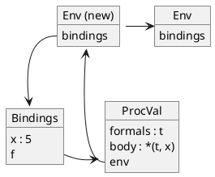

# Language V5

We normally prefer to use direct recursion instead of relying on the contrived
tricks described in the previous chapter. Specifically, we would like to write

```
let
  fact = proc(x) if zero?(x) then 1 else *(x, .fact(sub1(x)))
in
  .fact(5)
```

Unfortunately this program does not work as intended. Recall that in a `let`
expression the expressions on the right-hand side of the declarations are all
evaluated in the enclosing environment. Only after all the right-hand side
expressions have been evaluated do we bind each of the left-hand side
identifiers to the corresponding left-hand side results.

The above function's body refers to the identifier `fact` which is free in the
definition. Indeed the identifier `fact` does not appear in the function's
formal parameter list nor does it appear in the enclosing environment, which
in this small program, is
empty. Thus an attempt to apply the function fails because of an unbound
identifier.

To solve this problem, we create a new `let`-like expression that supports
direct recursion. Called `letrec`, it allows us to define functions supporting
direct recursion. The following is what we want:

```
letrec
  fact = proc(x) if zero?(x) then 1 else *(x, .fact(sub1(x)))
in
  .fact(5)
```

Evaluation of this program with `V5` produces `120`.

## A quick tour

The syntax of a `letrec` expression is the same as its `let` counterpart. The
difference lies in its semantics. Without going into details yet, the
declarations are evaluated in such a way as to allow them to refer to each
other. This evaluation strategy allows functions to call themselves recursively.
Specifically, in the example above, the identifier `fact` in the right-hand
side is bound to the same identifier in the left-hand side.

## Syntax

We require a new token (`LETREC`) as well as a new grammar rule:

```
<Exp:LetrecExp>  ::= LETREC <LetDecls> IN <Exp>
```

This rule depends on two non-terminal symbols (`LetDecls` and `Exp`) which we
have already defined in the context of the definition for `let` expressions.

## Semantics

The right-hand side of the expressions appearing in the declaration are
evaluated in the order in which they appear, using an environment where *all* of
the previous bindings in the `letrec` are accessible. In addition, if the
right-hand side expression is a function (i.e., a `ProcExp`),
it captures the entire environment
created by all of the bindings in the `letrec` expression. This evaluation
strategy means that functions defined in a `letrec` expression can refer to each
other. In particular, they can call themselves recursively.

This is unlike a normal `let`, in which the right-hand side expressions are all
evaluated in the *enclosing* environment, and the created bindings are only
accessible in the body. Consequently, the right-hand side expressions of a `let`
can be evaluated in any order, which is sometimes called *parallel evaluation*.
The only difference between the semantics of the `let` and `letrec` expression
is in the way in which we build the environment capturing the bindings issued
from the declarations.

### Order matters

Because right-hand side expressions are evaluated in the same environment they
update, the order in which declarations appear matters.

The program

```
letrec
  x = 3
  y = x
in
  y
```

evaluates to `3`.

The downside to `letrec` expressions is that declarations cannot be evaluated in
parallel. So, ideally, `letrec` should only be used when you need to define a
recursive function.

### Declarations

To implement the recursive behavior of a `letrec` expression, we define a new
method called `addLetrecBindings` in the `LetDecls` class.

```
LetDecls
%%%
def addLetrecBindings(self, env):
    env = env.extendEnv(Bindings())
    for (sym,e) in zip(self.symbolList, self.expList):
        val = e.eval(env)
        env.add(Binding(sym.lexeme, val))
    return env
```

This new method is passed the environment in which the `letrec` expression
appears and returns a new environment. To do so, the method performs the
following steps:

0. Immediately extend the current environment with an empty set of bindings.

1. In order,

   0. Evaluate each right-hand side expression in this new environment.

   1. Update the new environment with a new binding tying the left-hand side
      identifier to the result of its corresponding right-hand side expression.

2. Once all the declarations have been processed return the new environment.

Recall that the `LetDecls` initializer checks for duplicate left-hand side
identifiers during parsing. Since the grammar rule for `letrec` reuses
`LetDecls`, a `letrec` expression will also make this check.

### Example

Consider the following program:

```
letrec
  x = 5
  f = proc(t) *(t, x)
in
  .f(42)
```

The processing of its declaration proceeds as follows:

0. Create a new environment by extending the enclosing environment with an
   empty list of bindings.

```plantuml
@startuml
object "Env (new)" as Env {
  bindings
}

object "Env" as Prev {
  bindings
}

Env -> Prev

map Bindings

Env::bindings --> Bindings
@enduml
```

1. In the order in which the left-hand side identifiers appear, create a binding
   of the left-hand side identifier (`x` and then `f`) to the value of its
   corresponding right-hand side expression (`5` and then `proc(t) *(t, x)`) —
   where each right-hand side expression is evaluated in the extended
   environment — and add this binding to the extended environment.



2. Once all of the bindings have been added to the extended environment, return
   the extended environment.

### Body

We can now evaluate a `LetrecExp` object in exactly the same way as a `LetExp`
object:

```
LetrecExp
%%%
def eval(self, env):
    env = self.letDecls.addLetrecBindings(env)
    return self.exp.eval(env)
```

The key idea is to evaluate the right-hand side expressions of a `letrec` in an
environment that (self-referentially) includes all of the declared bindings.
Specifically:

0. Extends the current environment with all the declarations.

1. Evaluate the body in the extended environment.

## Mutual recursion

The `letrec` construct allows us to define *mutually recursive functions* — two
or more functions that call each other recursively. Here’s a classic example:

```
letrec
  even? = proc(x) if zero?(x) then 1 else .odd?(sub1(x))
  odd? = proc(x) if zero?(x) then 0 else .even?(sub1(x))
in
  .even?(11)
```

This program evaluates to `0` (i.e., false).

Notice that we have established a convention.
We use the character `?` at the end of variable names for
functions when they should be considered predicates that return true
(i.e., `1`) or false (i.e., `0`).
You may recall the `zero?` primitive was so named for the same reason.
The lexical specification of Languages `V5` and beyond will allow an
`IDENT` to end with a question mark, but it is beyond the capability
of PLCC to make sure language designers are following the convention;
that is up to us.

## Exercises

### Exercise 1

Can you define the `odd?`/`even?` mutually recursive functions in Language V4,
that is, without `letrec`?

## Going beyond

The Scheme programming language introduced the `letrec` construct to enable the
definition of mutually recursive functions.
