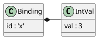
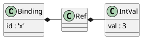
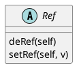
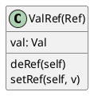
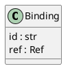
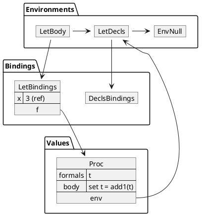
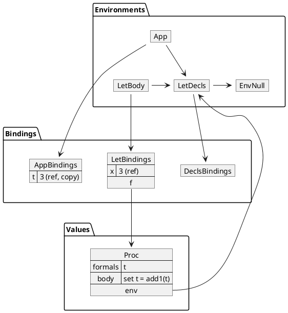

# Language Set

In this version of our language series, we allow for assignment of values to
variables. Languages that allow for the mutation of variables are called
*side-effecting*. Such languages are inherently more difficult to reason about,
which accounts for why functional programming has received much attention and
also for why it is so difficult to produce high-quality software in most
side-effecting programming languages.

In this language, evaluating the input

```
let
  x = 42
in
  { set x = add1(x) ; x }
```

produces `43`.

## A quick tour

The body of the `let` expression above is a sequence of two expressions. The
first expression assigns `x` a new value, `43`, that is, the original content of
`x` incremented by `1`. The second expression consists simply of the variable
`x`. Recall that the evaluation of a sequence returns the value produced by its
last expression. In this case, our program returns `43`, the updated content of
`x`.

The ability to assign a new value to a variable makes expression sequences more
interesting. Before introducing the capability, assignment of variables, all
expressions in a sequence but the last had no impact of the final value
produced.

## Syntax and semantics

We add variable assignment (also called mutation) with the `set` keyword as a
new form of expression. We choose the following concrete syntax for variable
mutation:

```
<Exp:SetExp>     ::= SET <SYMBOL> EQUALS <Exp>
```

Semantically, the evaluation of variable assignment returns the result of
evaluating the expression on the right-hand side of the equal sign but not
before assigning, as a new value, that result to the variable specified on the
left-hand side.

## Variable assignment

As an example consider the use of `set` in the input listed at the beginning of
this chapter:

```
set x = add1(x)
```

The mean of `x` on the left-hand side is different from its meaning on the
right-hand side. The expression `x` in the right-hand side of this "assignment"
represents an *expressed* value, whereas `x` on the left-hand side represents
a denoted value that can be modified. To implement variable assignment, we need
to find a way to disconnect denoted values from expressed values.

To solve this problem, we introduce the notion of a *reference*, something that
*refers* to a mutable location in memory. Instead of binding a variable directly
to an expressed value, we bind the variable to a reference which itself contains
an expressed value.

Before the Language Set, our bindings tied a name directly with an expressed
value.



Now a binding ties that name to a denoted value (i.e., a reference) which itself
points to an expressed value.



References will also be used to implement various parameter-passing mechanisms
as described later in these notes.

## Environment capture

The ability to modify the value bound to a variable allows us to "capture" an
environment in a function and use the function to modify its captured
environment. For example, let us evaluate the following SET program:

```
define g = let
             count = 0
           in
             proc() set count = add1(count)
.g()
.g()
.g()
```

Each invocation of the function `g` increments the value of `count` and returns
this newly incremented value. The value of `count` is captured in the `let`
bindings that defines the function. The variable `count` persists from one
invocation to the other because the function definition captures the environment
in which it is defined, namely the one with variable `count`.

In this example, the `count` variable is unbound in the top-level environment,
so an attempt to evaluation it throws an exception.

## Reference

For our purposes, we want a reference to be a Python object whose contents can
be mutated. When we bind a variable to a reference (its denoted value), this
binding does not change, but the contents of the reference itself — the thing it
refers to — can change.

The `Ref` abstract class embodies our notion of a reference.



For now, the only subclass of `Ref` is the `ValRef` class.



The contents of a `ValRef` object is a `Val`, and we say that such an object is
a *reference to a value*. Recall that a `Val` object is either an `IntVal` or a
`ProcVal` — the only two `Val` types that we currently have.

A `Ref` object has two methods: `deRef` and `setRef`. In the the `ValRef` class,
the `deRef` (dereference) method simply returns the `Val` object stored in the
object's `val` attribute, and the `setRef` (set reference) method modifies the
`val` attribute by changing it to the `Val` parameter `v` (and returning the new
`Val` object as well).

## Binding

Our denoted values (the things the variables are bound to) are now references
instead of values, so we need to change our `Binding` objects to bind an
identifier to a reference. (Notice that we use the terms "variable",
"identifier", and "symbol" interchangeably.)



In the `Env` class, we want `applyEnv` to continue to return a `Val` object,
whereas the bindings now associate identifiers with references, so we split up
the responsibilities as follows:

```python
def applyEnvRef(self, sym):
    """Abstract method"""
    raise NotImplementedError

def applyEnv(self, sym):
    return self.applyEnvRef(sym).deRef()
```

The `applyEnvRef` method behaves exactly like the previous `applyEnv` method
(but returns a `Ref` instead) and throws an exception if there is no reference
bound to the given symbol. The `applyEnv` method simply gets the `Ref` object
using `applyEnvRef` and dereferences it to return the corresponding value.

In our semantics code, we need to modify all of the instances of `Binding` or
`Bindings` objects so that they use references instead of values. To create a
"binding" of a variable to a value, first wrap the value into a new reference
and then bind the variable to the newly created reference. Here is an example
showing how to create a binding of the variable name `x` to (a reference to) an
integer `10`:

```python
var = 'x'
val = IntVal(10)
b = Binding(var, ValRef(val))
```

The `valsToRefs` static method in the `Ref` class takes a list of `Val`s and
returns a corresponding list of `Ref`s. This method is used, for example, in the
code for `AppExp` objects (which need to bind formal parameter symbols to
references to their actual parameter values) and for `LetExp` objects (which
need to bind their left-hand side variable symbols to reference to their
right-hand side expression values).

```python
@staticmethod
def valsToRefs(valList):
    return [ValRef(v) for v in valList]
```

## Implementation

So far, we have dealt only with the implementation details of environments. How
do we implement the semantics of `set` expressions? Coding its behavior is now
relatively straightforward:

```
SetExp
%%%
def eval(self, env):
    v = self.exp.eval(env)                     # RHS expression value
    ref = env.applyEnvRef(self.symbol.lexeme)  # LHS reference
    return ref.setRef(v)                       # set the ref and return val
```

Notice that a `set` expression evaluates to the value of the right-hand side of
the assignment. This observation means that multiple `set` operations can
appear in one expression.

For example, the following expression evaluates to `12`:

```
let
  t = 3
  u = 42
  v = 0
in
  { set v = set u = set t = add1(t) ; +(t, +(u, v)) }
```

The first expression in the body of this `let` gets evaluated like this:

```
set v = { set u = { set t = add1(t) } }
```

## Formal parameter

What happens if you try to mutate the value of an identifier that is one of the
formal parameters to a function? For example, what value is returned by the
following program?

```
let
  x = 3
  p = proc(t) set t = add1(t)
in
  { .p(x) ; x }
```

In our function application semantics (see the `AppExp` code), the formal
parameters are bound to (references to) the *values* of the actual parameters.
Since the value of the actual parameter `x` in the expression `.p(x)` is `3`,
this means that the variable `t` in the body of the function is bound to (a
reference to) the value `3`, and evaluating the body of the function modifies
this binding to the value `4`, but it is the variable `t`, not the variable `x`,
that gets modified. Thus the value of this entire expression is `3`.

The following illustration shows the environment immediately before the function
application `.p(x)`. In particular, the binding of `x` to a reference to the
value `3`.



The following illustration show the environment during the function application
`.p(x)`, binding the formal parameter `t` to a *new* reference containing a copy
of the value of `x`.



## Reference

* "Language SET," ourPLCC, version 1.0.0,
  [https://github.com/ourPLCC/languages-ng/tree/v1.0.0/src/SET](https://github.com/ourPLCC/languages-ng/tree/v1.0.0/src/SET)

## Going beyond

`SET` is not the only language where assignments return a value. The C
programming language specifies similar semantics for its assignments. Here is
an example of a loop written in C where reading a character from standard input
and checking an end-of-file condition occurs simultaneously:

```c
while ((c = getchar()) != EOF) {
    ...
}
```
