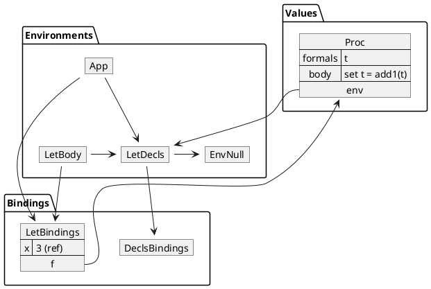

# Language REF

Consider the following program:

```
let
  x = 3
  p = proc(t) set t = add1(t)
in
  { .p(x) ; x }
```

Running this program with `REF` yields `4` while the same program yield `3`
under `SET`, the language we studied in the previous chapter. What is different?

## A quick tour

A parameter-passing semantics that evaluates actual parameters and that binds
the formal parameters to these actual parameter values is called
*call-by-value*. This parameter-passing strategy is what is used in languages
`V1` to `V6`. In the language `SET`, where bindings are to references instead of
values, the actual parameter values are turned into *new* references, and these
references are bound to the formal parameters. The figure below illustrates this
situation. Assuming the function body is about to be evaluated, it shows two
environments, one is the caller, the other the callee which gets a copy of the
actual parameter.

```plantuml
@startuml

package Environments {
    map "Caller" as caller
}

package Environments {
    map "Callee" as callee
}

package Arguments {
    map "Actual" as actual {
        x =>
    }
}

package Arguments {
    map "Formal" as formal {
        t =>
    }
}

callee <- caller

caller --> actual
callee --> formal

package Values {
        map "Copy" as copy {
        3 =>
    }
}

package Values {
        map "Original value" as original {
        3 =>
    }
}

actual --> original
formal --> copy
@enduml
```

Suppose we *want* a behavior that binds the formal parameter `t` to the *same*
reference that is bound to `x` instead of a new reference containing a copy.
The following diagram shows how the bindings change when `t` is bound to the
same reference as `x`.

```plantuml
@startuml

package Environments {
    map "Caller" as caller
}

package Environments {
    map "Callee" as callee
}

package Arguments {
    map "Actual" as actual {
        x =>
    }
}

package Arguments {
    map "Formal" as formal {
        t =>
    }
}

callee <- caller

caller --> actual
callee --> formal

package Values {
        map "Original value" as original {
        3 =>
    }
}

actual --> original
formal --> original
@enduml
```

Such a parameter-passing semantics is called *call-by-reference*. We explore
call-by-reference next, along with variants on this theme.

## Call-by-reference

To recap:

* The parameter-passing semantics that we have been using up to now is called
  *call-by-value*. In call-by-value semantics — also referred to as simply
  *value semantics*, when an actual parameter expression in a function
  application is a variable, the function's corresponding formal parameter
  denotes a new reference to the expressed value of the actual parameter.

* In *call-by-reference* semantics — also referred to as simply *reference
  semantics*, when an actual parameter expression in a function application is a
  variable, the function's corresponding formal parameter denotes the *same
  reference* as the actual parameter.

The differences between value and reference semantics only apply when the actual
parameter expression is a variable. When the actual parameter expression is not
a variable, the corresponding formal parameter always denotes a new reference to
the expressed value of the actual parameter.

Observe that in `let` and `letrec` expressions, we always use value semantics
for variable bindings. This observation means that each left-hand side variable
in a `let`/`letrec` expression always denotes a new reference to the expressed
value of its corresponding right-hand side expression.

Using call-by-reference semantics, the program

```
let
  x = 3
  p = proc(t) set t = add1(t)
in
  { .p(x) ; x }
```

returns the value `4`, since `t` denotes the same reference as `x`. The
following figure illustrates the bindings active during evaluation of the
application `p(x)` (just prior to evaluating the function body):



## L-value versus non-L-value

When actual parameter expressions are not themselves variables, we fall back to
value semantics. To illustrates this situation, consider the value returned by
the following program:

```
let
  x = 3
  p = proc(t) set t = add1(t)
in
  { .p(+(x, 0)) ; x }
```

Clearly the expressed value of the actual parameter `+(x, 0)` is the same as
that of `x`, but the expression `+(x, 0)` is not a variable, so value semantics
apply to this actual parameter. This means that when we apply the function `p`,
the formal parameter `t` denotes a *new* reference to the value of this
expression: the variables `t` and `x` have the same expressed values, but they
have different denoted values, so modifying `t` does not affect the value of
`x`. This expression evaluates to `3`.

The term *L-value* refers to an expression that can be interpreted as a
reference. (It is called an L-value because it is the sort of expression that
can appear to the *left* of the equal sign in a `set`.) While a variable `x`
can always be considered as an L-value, the expression `+(x, 0)` can only be
interpreted as a value, never a reference. In Language REF, only variable
expressions are L-values.

In summary, if an actual parameter is an L-value in Language REF, (and
therefore can be interpreted as a reference), then the corresponding formal
parameter is bound to the same reference. If an actual parameter is something
other than an L-value, then the corresponding formal parameter is bound to a
*new* temporary reference containing the value of the actual parameter.

## Specification

Our `REF` language has exactly the same grammar rules as our `SET` language. The
*only* difference are in the bindings of formal parameters during function
application. As the earlier discussion in this chapter shows, we need to handle
actual parameters that are variables differently from actual parameters that are
more general expressions. The idea here is to define an `evalRef` method for
instances of the `Exp` classes that takes care of how to translate themselves
into a reference: for anything but a `VarExp`, `evalRef` evaluates the
expression and returns a new reference to the value. For a `VarExp`, `evalRef`
returns the same reference that the actual parameter denotes.

So in the `Exp` abstract class, the `evalRef` method has the following *default*
behavior:

```
Exp
%%%
def evalRef(self, env):
    return ValRef(self.eval(env))
%%%
```

The `VarExp` subclass — *and only this class* — implements `evalRef` as:

```
VarExp
%%%
def evalRef(self, env):
    return env.applyEnvRef(self.symbol.lexeme)
%%%
```

The `evalRef` method in the `VarExp` subclass overrides the `evalRef` method in
the `Exp` abstract class. In all other classes that extend the `Exp` class, the
default definition in the parent `Exp` class is used.

The other change is in the `Rands` code. In the `SET` language, the `evalRands`
method was used in the implementation of `eval` for both a `LetExp` object and
an `AppExp` object, since both created new bindings to values. In the `REF`
language, an `AppExp` object needs new bindings to values except for actual
parameters which are variables. Therefore, to implement the correct `eval`
semantics for an `AppExp` object, we need to collect `evalRef` references
instead of `eval` values to bind them to the formal parameters. The method
`evalRandsRef` in the `Rands` class does this work for us. The `eval method` in
the `AppExp` class uses the `evalRandsRef` method to create the bindings of the
formal parameters to their appropriate references. The definition for
`evalRandsRef` follows:

```
Rands
%%%
def evalRandsRef(self, env):
    return [e.evalRef(env) for e in self.expList]
%%%
```

Remember that we always use value semantics for `let` bindings. This means that
a Language REF program such as

```
let
  x = 3
in
  let
    y = x
  in
    { set y = add1(y) ; x }
```

evaluates to `3`.

Our observation that any `let` can be re-written as an equivalent function
application (see [this](./11-v4.md#equivalence-of-appexp--procexp-and-letexp)
section) no longer applies with languages that implement call-by-reference
semantics. Specifically, if we attempt to re-write the inner `let` in the
above Language REF program as a function application using the algorithm given
[there](./11-v4.md#equivalence-of-appexp--procexp-and-letexp), we get

```
let
  x = 3
in
  .proc(y) { set y = add1(y) ; x } (x)
```

which evaluates to `4`.

## References

* "Language REF," ourPLCC, version 1.0.0,
  [https://github.com/ourPLCC/languages-ng/tree/v1.0.0/src/REF](https://github.com/ourPLCC/languages-ng/tree/v1.0.0/src/REF)

* "Evaluation strategy," Wikipedia, last modified April 30, 2026,
  [https://en.wikipedia.org/wiki/Evaluation_strategy](https://en.wikipedia.org/wiki/Evaluation_strategy)

* "Value (computer science)," Wikipedia, last modified September 6, 2026,
  [https://en.wikipedia.org/wiki/Value_(computer_science)](https://en.wikipedia.org/wiki/Value_(computer_science))

## Going beyond

Many programming languages only support one form of parameter-passing strategy.
For instance the C programming language only supports call-by-value. Because
this language supports taking the address of a variable, code can pass the
address (that is, a reference) of a variable instead of its value simulating
call-by-reference semantics.

In contrast, C++ supports both call-by-value and call-by-reference. The code
below illustrates the two supported parameter-passing strategies.

```c++
void f(int x) {
    x = 10; // Call-by-value; only modifies the local copy
}

void g(int& x) {
    x = 10; // Call-by-reference; modifies the original variable
}
```
